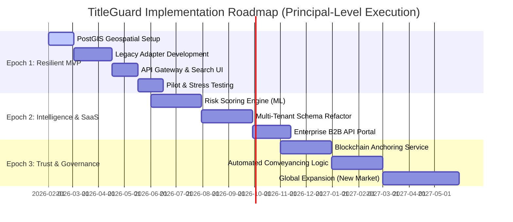

### 1. Implementation Timeline

---

### 2. High-Level Implementation Gantt (Markdown)

| Phase | Milestone | Duration | Primary Tech Focus | Strategy/Outcome |
| --- | --- | --- | --- | --- |
| **Epoch 1** | **Resilient MVP** | **4 Months** | FastAPI, PostGIS, Celery | Solve for legacy system latency and validate the "Search" value proposition. |
| **Epoch 2** | **SaaS & Intelligence** | **6 Months** | ML-Scoring, Multi-Tenancy | Move from a "Tool" to a "Platform" capable of regional scaling and B2B API sales. |
| **Epoch 3** | **Global Governance** | **8 Months+** | L2 Blockchain, Smart Contracts | Codify legal certainty and expand into cross-border property infrastructure. |

---

> "The critical path in Epoch 1 is the **Legacy Adapter**. Because emerging market registries are high-latency and unstable, the success of the platform depends on our ability to abstract that volatility away from the user immediately. We don't move to Epoch 2 (Scaling) until the **Asynchronous Reliability Buffer** has been battle-tested against real-world portal outages."

